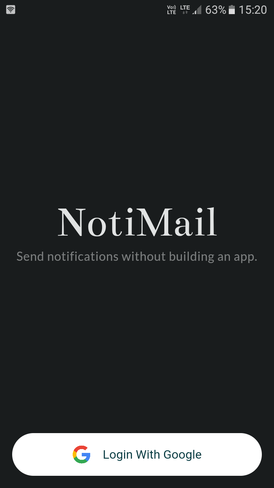
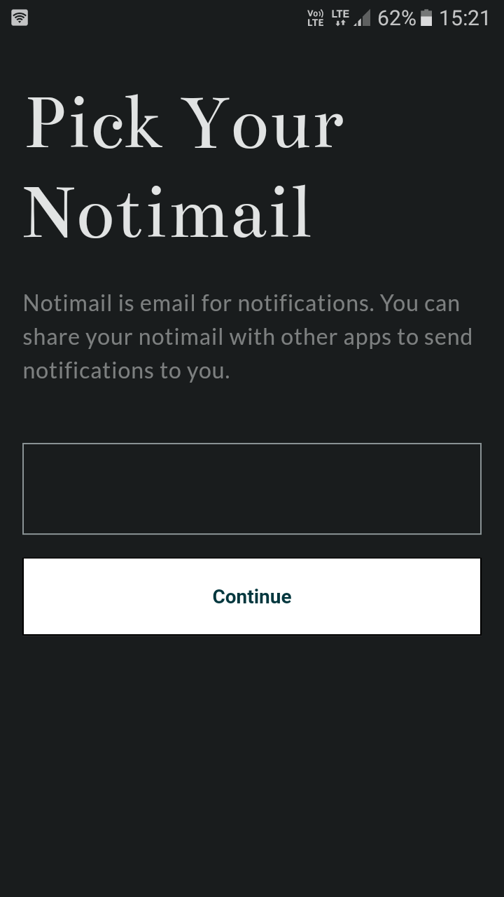
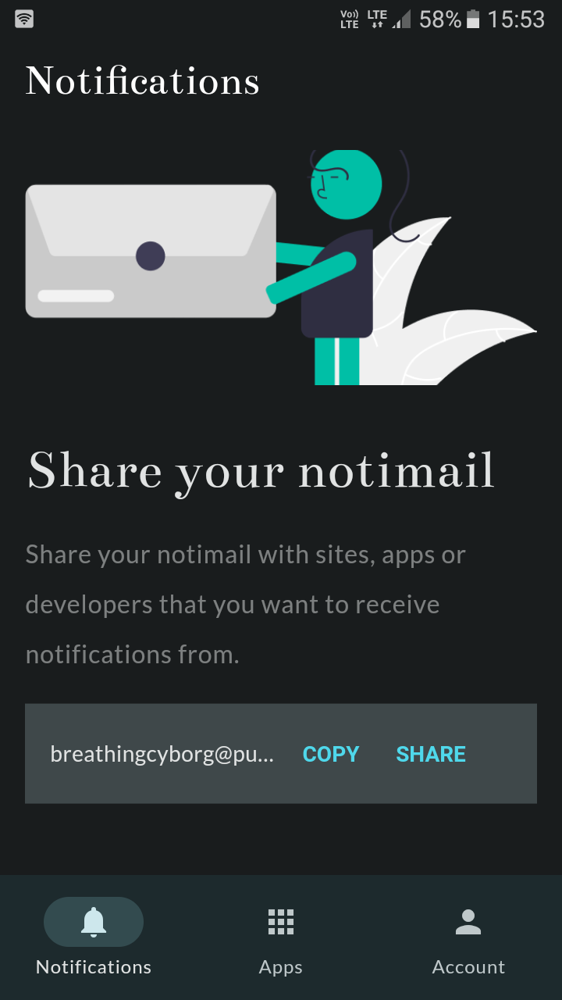
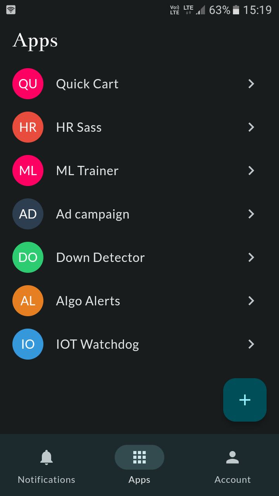
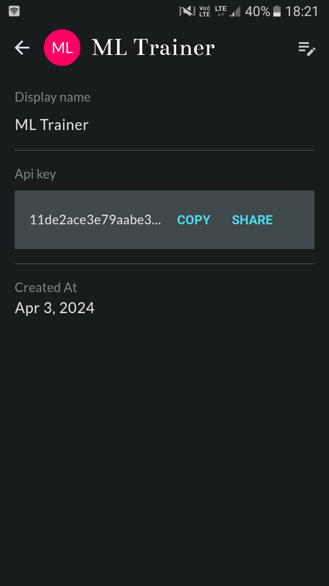
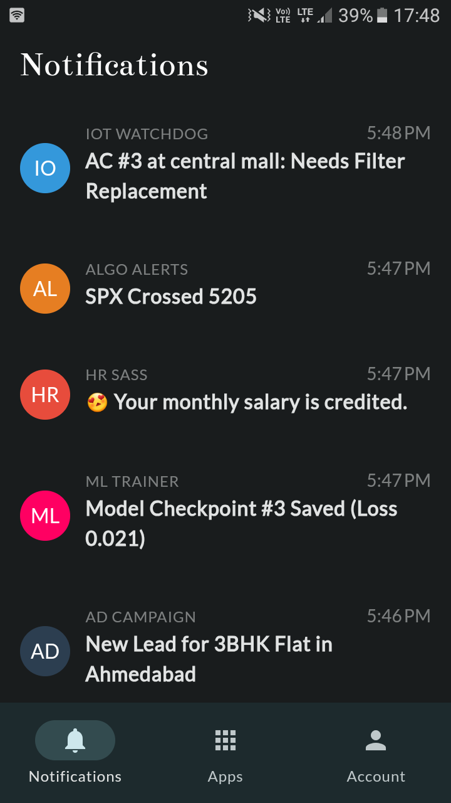
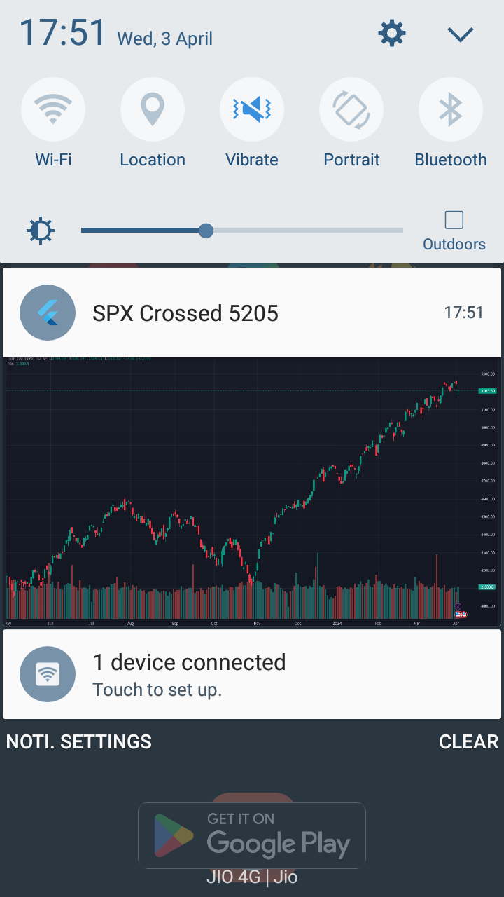
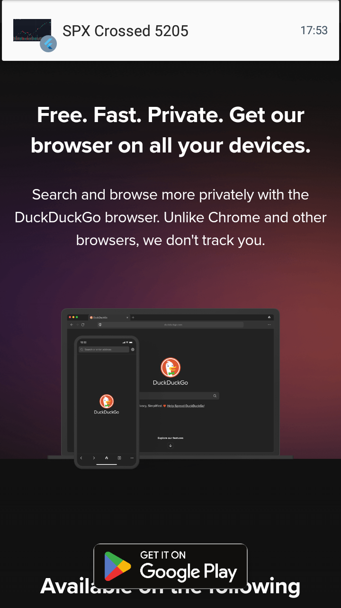

# Pushnoti App

App to send notifications without building your own app. Android only.

## Api Repo
[Api Repo](https://github.com/breathingcyborg/pushnoti_api)


## Screenshots

|          |          |          |
|----------|----------|----------|
|  |  |  |
|  |  |  ) |
| |  | |

## How to send notification?
1. **Login**
2. **Pick Notimail:** Notimail is unique address that can be used to receive notification.
3. **Create Apps**: Create as many apps as you want. Each apps get's its own api key which can be used to send notification.
4. **Send notification**: Send a simple post request with your api of your app.

    ```bash
    curl -X POST \
    -H "Authorization: Bearer APP_API_KEY" \
    -H "Content-Type: application/json" \
    -d '{
        "to": "breathingcyborg@pushnoti.com",
        "priority": "standard",
        "title": "Title",
        "message": "Message(optional)",
        "image": "imageUrl (optional)"
    }' http://localhost:3000/notifications
    ```

## For Recipients
1. **Login** 
2. **Pick Notimail:** Notimail is unique address that can be used to receive notification.
3. **Share Notimail:** Share your notimail with sites / developers from whom you wish to receive notifications.

## Request Payload format
```
{
    "to": "recipient_notimail@pushnoti.com",
    "title": "Notification Title",
    "message": "Notification Message(optional)",
    "priority": "standard",
    "image": "https://example.com/image.jpg"
}
```

## Notification Priority Levels

Notifications can have different priority levels based on their importance and urgency.

Priority is specified as "priority" in request payload. It can take three values **standard**, **high**, **urgent**.

1. **standard**: 
    * Suitable for normal, non-urgent notifications.
    * These notifications are silent and non-intrusive.

2. **high**: 
    * Intended for notifications that have high priority but not not urgent.
    * These notifications include sound to grab the user's attention.

3. **urgent**: 
    * For critical and time-sensitive notifications.
    * These notifications are intrusive, meaning they will show notification to the user even if they are using another app.
    * They play an annoying sound and vibrate the phone, ensuring the user is promptly notified.
